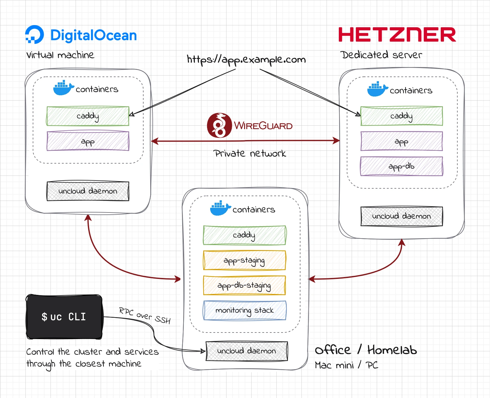

<div align="center">
  
  <h1>Uncloud</h1>
  <p><strong>Docker simplicity. Multi-machine power.</strong></p>
</div>

Uncloud is a lightweight clustering and container orchestration tool that lets you deploy and manage web apps across
cloud VMs and bare metal with minimized cluster management overhead. It creates a secure WireGuard mesh network between
your Docker hosts and provides automatic service discovery, load balancing, ingress with HTTPS, and simple CLI commands
to manage your apps.

Unlike traditional orchestrators, there's no central control plane and quorum to maintain. Each machine maintains a
synchronized copy of the cluster state through peer-to-peer communication, keeping cluster operations functional even if
some machines go offline.

Uncloud aims to be the solution for developers who want the flexibility of self-hosted infrastructure without the
operational complexity of Kubernetes.

## ✨ Features

* **Deploy anywhere**: Combine cloud VMs, dedicated servers, and bare metal into a unified computing environment —
  regardless of location or provider.
* **Zero-config private network**: Automatic WireGuard mesh with peer discovery and NAT traversal. Containers get unique
  IPs for direct cross-machine communication.
* **No control plane**: Fully decentralized design eliminates single points of failure and reduces operational overhead.
* **Imperative over declarative**: Favoring imperative operations over state reconciliation simplifies both the mental
  model and troubleshooting.
* **Service discovery**: Built-in DNS server resolves service names to container IPs.
* **Automatic HTTPS**: Built-in Caddy reverse proxy handles TLS certificate provisioning and renewal using Let's
  Encrypt.
* **Docker-like CLI**: Familiar commands for managing both infrastructure and applications.
* **Remote management**: Control your entire infrastructure through SSH access to any single machine in the cluster.

Coming soon:

* Project isolation through environments/namespaces
* Infrastructure as Code using Docker Compose format
* Persistent volumes and secrets management
* Monitoring and log aggregation
* Database deployment and management
* Curated application catalog

Here is a diagram of an Uncloud multi-provider cluster of 3 machines:



## 💫 Why Uncloud?

Modern cloud platforms like Heroku and Render offer amazing developer experiences but at a premium price. Traditional
container orchestrators like Kubernetes provide power and flexibility but require significant operational expertise. I
believe there's a sweet spot in between — a pragmatic solution for the majority of us who aren't running at Google
scale. You should be able to:

* **Own your infrastructure and data**: Whether driven by costs, compliance, or flexibility, run applications on any
  combination of cloud VMs and personal hardware while maintaining the cloud-like experience you love.
* **Stay simple**: Don't worry about control planes, highly-available clusters, or complex YAML configurations for
  common use cases.
* **Build with proven primitives**: Get production-grade networking, deployment primitives, service discovery, load
  balancing, and ingress with HTTPS out of the box without becoming a distributed systems expert.
* **Support sustainable computing** 🌿: Minimize system overhead to maximize resources available for your applications.

Uncloud's goal is to make deployment and management of containerized applications feel as seamless as using a cloud
platform, whether you're running on a $5 VPS, a spare Mac mini, or a rack of bare metal servers.

## 🚀 Quick start

1. Install Uncloud CLI:

```bash
brew install psviderski/tap/uncloud

# or using curl (macOS/Linux)
curl -fsS https://get.uncloud.run/install.sh | sh
```

2. Initialize your first machine:

```bash
uc machine init root@your-server-ip
```

3. Create a DNS A record in your DNS provider (Cloudflare, Namecheap, etc.) that points `app.example.com` to your
   server's IP address. Allow a few minutes for DNS propagation.
4. Deploy your app from a Docker image:

```bash
uc run -p app.example.com:8000/https my-app-image
```

That's it! Your app is now running and accessible at https://app.example.com ✨

5. Clean up when you're done:

```bash
uc ls
# Copy the service ID from the output and remove it:
uc rm my-app-id
```

## ⚙️ How it works

Check out the [design document](docs/design.md) to understand Uncloud's design philosophy and goals. Here, let's peek
under the hood to see what happens when you run certain commands.

**When you initialize a new cluster on a machine:**

```bash
uc machine init root@your-server-ip
```

1. The CLI SSHs into the machine and installs Docker, the `uncloudd` machine daemon and
   [corrosion](https://github.com/superfly/corrosion) service, managed by systemd.
2. Generates a unique WireGuard key pair, allocates a dedicated subnet `10.210.0.0/24` for the machine and its
   containers, and configures `uncloudd` accordingly. All subsequent communication happens with `uncloudd`
   through its gRPC API over SSH.
3. Configures and starts `corrosion`, a CRDT-based distributed SQLite database to share cluster state between machines.
4. Creates a Docker bridge network connected to the WireGuard interface.
5. This machine becomes an entry point for the newly created cluster which is stored in the cluster config under
   `~/.config/uncloud` on your local machine.

**When you add another machine:**

```bash
uc machine add ubuntu@second-server-ip
```

1. The second machine gets provisioned just like the first. A non-root SSH user will need `sudo` access.
2. Allocates a new subnet `10.210.1.0/24` for the second machine and its containers.
3. Registers the second machine in the cluster state and exchanges WireGuard keys with the first machine.
4. Both machines establish a WireGuard tunnel between each other, allowing Docker containers connected to the bridge
   network to communicate directly across machines.
5. Configures and starts `corrosion` on the second machine to sync the cluster state.
6. The second machine is added as an alternative entry point in the cluster config.
7. If one of the machines goes offline, the other machine can still serve cluster operations.

If one more machine is added, the process repeats with a new subnet. The new machine needs to establish a WireGuard
connection with only one of the existing machines. Other machines will learn about it through the shared cluster state
and automatically establish a WireGuard tunnel with it.

**When you run a service:**

```bash
uc run -p app.example.com:8000/https my-app-image
```

1. CLI picks a machine to run your container.
2. `uncloudd` that the CLI communicates with uses [`grpc-proxy`](https://github.com/siderolabs/grpc-proxy) to forward
   the request to the target machine to launch a container there.
3. `uncloudd` on the target machine starts the Docker container in the bridge network and stores its info in the
   cluster's distributed state.
4. The container gets a cluster-unique IP address from the bridge network (in the `10.210.X.2-254` range) and becomes
   accessible from other machines in the cluster.
5. Caddy reverse proxy which runs in [`global`](https://github.com/compose-spec/compose-spec/blob/main/deploy.md#mode)
   mode on each machine watches the cluster state for new services and updates its configuration to route traffic to the
   new container.

Look ma, no control plane or master nodes to maintain! Just a simple overlay network and eventually consistent state
sync that lets machines work together. Want to check on things or make changes? Connect to any machine either implicitly
using the CLI or directly over SSH. They all have the complete cluster state and can control everything. It's like each
machine is a full backup of your control plane.

## 🏗 Project status

Uncloud is currently in active development and is **not ready for production use**. Features may change significantly
and there may be breaking changes between releases.

I'd love your input! Here's how you can contribute:

* 🐛 Found a bug? [Open an issue](https://github.com/psviderski/uncloud/issues)
* 💡 Have ideas? [Join the discussion](https://github.com/psviderski/uncloud/discussions)

## 📫 Stay updated

* [Subscribe](https://uncloud.run/#subscribe) to my newsletter to follow the progress, get early insights into new
  features, and be the first to know when it's ready for production use.
* Watch this repository for releases.
* Follow [@psviderski](https://github.com/psviderski) on GitHub.
