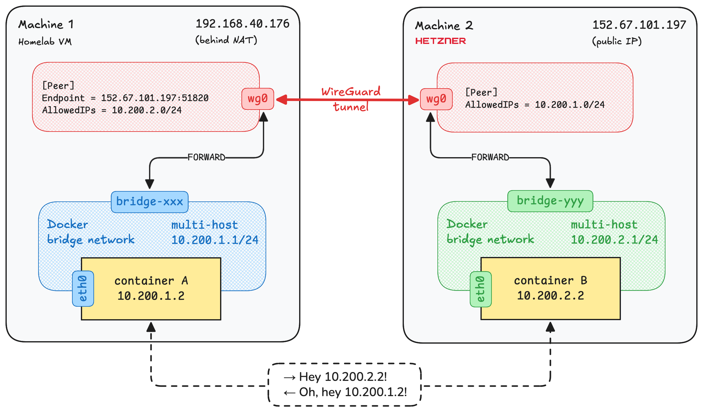

You want your Docker containers to talk to each other, but they're running on different machines. Perhaps across
different cloud providers or mixing cloud with on-prem. The usual approach of mapping services to host ports quickly
becomes a pain. Worse, if they're on the public internet, you need to secure every exposed endpoint with TLS and auth.

What if your containers on different machines could communicate directly without exposing any ports? Using their private
Docker IPs, as if they were on the same machine. Here's how you can use pure WireGuard and some clever networking tricks
to make this work.

## What we're building

Docker containers are typically connected to a [bridge network](https://docs.docker.com/engine/network/drivers/bridge/)
on their host machine, which allows them to communicate with each other. A bridge network also provides isolation from
containers not connected to it and other networks on the host. What we want to achieve is connecting these bridge
networks across machines so that containers on different machines can communicate as if they were connected to the same
local bridge network.

The incantation we need is called a site-to-site VPN. Any solution would work. Moreover, if the machines are on the same
local network, they're already connected and only lack the appropriate routing configuration. But I'll describe a more
versatile approach that works even when the machines are on different continents or behind NAT. WireGuard is the ideal
solution for this use case: it's lightweight, [fast](https://www.wireguard.com/performance/), simple to configure,
provides [strong security](https://www.wireguard.com/protocol/) and NAT traversal.

We'll create a new Docker bridge network `multi-host` on each machine with unique subnets. Then establish a secure
WireGuard tunnel between the machines and configure IP routing so that `multi-host` bridge networks become routable via
the tunnel. Finally, we'll run containers on each machine connected to the `multi-host` network and test that they can
communicate with each other using their private IPs.

I will use these two machines:

* Machine 1: Debian 12 virtual machine in my homelab network in Australia, which is behind NAT
* Machine 2: Ubuntu 24.04 server from Hetzner in Finland that has a public IP



<!-- truncate -->

## Prerequisites

- Basic knowledge of [Docker networking](https://docs.docker.com/network/) and [WireGuard](https://www.wireguard.com/).
  If you're new to these topics, you might want to read up on them first.
- At least two Linux machines with root access and Docker installed. They should be on the same network or be able to
  communicate over the internet.

## Step 1: Configure Docker networks

Most of the commands in this guide require root privileges. You can run them with `sudo` or log in as root. I'll start
root shells on both machines with `sudo -i` for convenience.

We can't connect the default [Docker bridge networks](https://docs.docker.com/engine/network/drivers/bridge/) across
machines because they use the same subnet (`172.17.0.0/16` by default). We need them to have non-overlapping addresses
so that we can set up routing between them later.

Therefore, let's create new Docker bridge networks on each machine with manually specified unique subnets. You can
choose any subnets from
the [private IPv4 address ranges](https://en.wikipedia.org/wiki/Private_network#Private_IPv4_addresses)
that do not overlap with each other or with your existing networks. I'll use `10.200.1.0/24` and `10.200.2.0/24`
for Machine 1 and Machine 2, respectively. They don't even need to be sequential or be part of the same larger network.
However, using a common parent network (like `10.200.0.0/16` in my case) can simplify firewall rules and make it easier
to manage more machines later.

You can use any name for the Docker networks. I'll call them `multi-host` for clarity.

```shell
# Machine 1
docker network create --subnet 10.200.1.0/24 -o com.docker.network.bridge.trusted_host_interfaces="wg0" multi-host
# Machine 2
docker network create --subnet 10.200.2.0/24 -o com.docker.network.bridge.trusted_host_interfaces="wg0" multi-host
```

Starting with Docker 28.2.0 ([PR](https://github.com/moby/moby/pull/49832)), you have to explicitly specify from which
host interfaces you
allow [direct routing](https://docs.docker.com/engine/network/packet-filtering-firewalls/#direct-routing) to containers
in bridge networks. This is done by specifying the `com.docker.network.bridge.trusted_host_interfaces` option when
creating the network. In our case, we want to allow routing via the WireGuard interface `wg0` that will be created in
the next step.

Provide this option even if you're using an older Docker version, as it'll be required if you upgrade Docker in the
future.

## Step 2: Connect Docker networks with WireGuard

By default, WireGuard uses the UDP port 51820 for communication. To establish a tunnel, at least one of the machines
needs to be able to reach the other's port over the internet or local network. Please make sure it's not blocked by a
firewall on both machines.

For example, when using `iptables`, you can allow incoming UDP traffic on port 51820 with the following command:

```shell
iptables -I INPUT -p udp --dport 51820 -j ACCEPT
```

Install WireGuard utilities and generate key pairs on both machines:

```shell
apt update && apt install wireguard
# Change the mode for files created in the shell to 0600
umask 077
# Create 'privatekey' file containing a new private key
wg genkey > privatekey
# Create 'publickey' file containing the corresponding public key
wg pubkey < privatekey > publickey
```

Create WireGuard configuration files using the generated keys.

On Machine 1, create `/etc/wireguard/wg0.conf`:

```ini
[Interface]
ListenPort = 51820
PrivateKey = <replace with 'privatekey' file content from Machine 1>

[Peer]
PublicKey = <replace with 'publickey' file content from Machine 2>
# IP ranges for which a peer will route traffic: Docker subnet on Machine 2
AllowedIPs = 10.200.2.0/24
# Public IP of Machine 2
Endpoint = 157.180.72.195:51820
# Periodically send keepalive packets to keep NAT/firewall mapping alive
PersistentKeepalive = 25
```

On Machine 2, create `/etc/wireguard/wg0.conf`:

```ini
[Interface]
ListenPort = 51820
PrivateKey = <replace with 'privatekey' file content from Machine 2>

[Peer]
PublicKey = <replace with 'publickey' file content from Machine 1>
# IP ranges for which a peer will route traffic: Docker subnet on Machine 1
AllowedIPs = 10.200.1.0/24
# Reachable endpoint of Machine 1
# Endpoint =
# Periodically send keepalive packets to keep NAT/firewall mapping alive
PersistentKeepalive = 25
```

Refer to the
[Unofficial WireGuard Documentation](https://github.com/pirate/wireguard-docs?tab=readme-ov-file#config-reference)
for more details on the configuration options.

Note that the `Endpoint` option could be omitted on one of the machines if the peer is not reachable from that machine.
In my case, Machine 1 is behind NAT in my private homelab network which is not reachable from the remote Hetzner
server (Machine 2). The bidirectional tunnel can still be established in this case but Machine 1 must initiate the
connection.

If both of your machines are reachable from each other, you should specify the `Endpoint` option in both configs which
will allow them to establish the connection without waiting for the other side to initiate it. If both of your machines
are behind NAT, see [NAT to NAT Connections](https://github.com/pirate/wireguard-docs#NAT-to-NAT-Connections) for more
information.

Note also that we don't set the `Address` option in the configs because we don't want to assign any IP addresses to the
WireGuard interfaces. We want the tunnel to only encapsulate and transfer packets from the `multi-host` bridge networks
and don't want either end of it to be the destination for the packets.

As the key pairs are now specified in the configuration files, you can remove the `privatekey` and `publickey` files on
both machines:

```shell
rm privatekey publickey
```

Now start the WireGuard interface `wg0` on both machines:

```shell
wg-quick up wg0
```

Verify that the tunnel is up and running on any of the machines:

```shell
$ wg show
interface: wg0
  public key: 4P6scLYcHdgwU8tMkQYGjq6pu4KvrwKyKIg7JuP6E30=
  private key: (hidden)
  listening port: 51820

peer: 0WDgQ+XkHkODI+3xT4APiI9GJS7MvjGH6wtk+W57TgM=
  endpoint: 157.180.72.195:51820
  allowed ips: 10.200.2.0/24
  latest handshake: 12 seconds ago
  transfer: 124 B received, 624 B sent
  persistent keepalive: every 25 seconds
```

If you see the `latest handshake` time updating, it means the tunnel is working correctly.

## Step 3: Configure IP routing

You've established the WireGuard tunnel, but packets between containers won't flow yet. You need to configure IP routing
between the tunnel and the container networks.

Docker daemon automatically enables IP forwarding in the kernel when it starts, so you don't need to manually configure
`net.ipv4.ip_forward` with `sysctl`.

The challenge is that Docker blocks traffic between external interfaces and container networks by default for security
reasons. You need to explicitly allow WireGuard traffic from `wg0` interface to reach your containers via the
`multi-host` bridge interface. Docker uses iptables, so you can allow this traffic by adding a rule to the `FORWARD`
chain before any other Docker-managed rules that would drop it.

Fortunately, Docker creates a special `DOCKER-USER` chain exactly for this purpose. It's processed before other
Docker-managed chains, allowing you to add custom rules that won't be overridden by Docker.

To create the required iptables rule, you need to find the bridge interface name for the `multi-host` network you
created earlier. It's named `br-<short-network-id>`, where `<short-network-id>` is the first 12 characters of the
network ID.

Add the iptables rule to allow traffic from `wg0` to `multi-host` bridge on Machine 1:

```shell
$ docker network ls -f name=multi-host
NETWORK ID     NAME         DRIVER    SCOPE
661096b2a5d9   multi-host   bridge    local
$ iptables -I DOCKER-USER -i wg0 -o br-661096b2a5d9 -j ACCEPT
```

Add the iptables rule to allow traffic from `wg0` to `multi-host` bridge on Machine 2:

```shell
$ docker network ls -f name=multi-host
NETWORK ID     NAME         DRIVER    SCOPE
48f808048e7c   multi-host   bridge    local
$ iptables -I DOCKER-USER -i wg0 -o br-48f808048e7c -j ACCEPT
```

The traffic in the other direction (from `multi-host` bridge to `wg0`) is not blocked by Docker by default. But it still
won't be able to make it through the tunnel. The reason is that Docker creates a `MASQUERADE` rule in the `nat` table
for every bridge network with option
[`com.docker.network.bridge.enable_ip_masquerade`](https://docs.docker.com/engine/network/drivers/bridge/#options) set
to `true` (which is the default). In my case, the rule looks like this on Machine 1:

```
POSTROUTING -s 10.200.1.0/24 ! -o br-661096b2a5d9 -j MASQUERADE
```

This essentially configures NAT for all external traffic coming from containers which is necessary for allowing them to
access the internet and other external networks. However, it equally applies to the traffic going through the `wg0`
interface. It tries to masquerade the source IP address of the packets with the IP address of the `wg0` interface and
fails because the `wg0` interface doesn't have an IP. This results in the packets being
[dropped](https://elixir.bootlin.com/linux/v6.15.5/source/net/netfilter/nf_nat_masquerade.c#L54-L58).

You could assign an IP address to `wg0` but this would cause the following unwanted side effects:

- Containers from other Docker networks on the same machine could route through the tunnel to reach remote `multi-host`
  containers, violating Docker's network isolation model.
- Remote containers would see all connections as coming from the `wg0` IP instead of the actual container IPs.

Let's instead add another rule to the `POSTROUTING` chain in the `nat` table to skip masquerading for the traffic from
the `multi-host` network going through the tunnel.

Run on Machine 1:

```shell
iptables -t nat -I POSTROUTING -s 10.200.1.0/24 -o wg0 -j RETURN
```

Run on Machine 2:

```shell
iptables -t nat -I POSTROUTING -s 10.200.2.0/24 -o wg0 -j RETURN
```

## Step 4: Testing

Now you can finally run containers on both machines connected to their `multi-host` networks and test that they can
communicate.

Run a [whoami](https://hub.docker.com/r/traefik/whoami) container on Machine 2 which listens on port 80 and replies with
the OS information and HTTP request that it receives:

```shell
docker run -d --name whoami --network multi-host traefik/whoami
```

Get its IP address:

```shell
$ docker inspect -f "{{range .NetworkSettings.Networks}}{{.IPAddress}}{{end}}" whoami
10.200.2.2
```

Now fetch `http://10.200.2.2` from inside a container on Machine 1.

Drum roll, please! 🥁

```shell
$ docker run -it --rm --network multi-host alpine/curl http://10.200.2.2
Hostname: bdb55fc9d9ae
IP: 127.0.0.1
IP: ::1
IP: 10.200.2.2
RemoteAddr: 10.200.1.2:37682
GET / HTTP/1.1
Host: 10.200.2.2
User-Agent: curl/8.14.1
Accept: */*
```

Yay, it works! The request came from the container `10.200.1.2` on Machine 1 and was served by the container
`10.200.2.2` on Machine 2.

You can ping remote containers or use any other network protocols to communicate with them:

```shell
$ docker run -it --rm --network multi-host alpine:latest ping -c 3 10.200.2.2
PING 10.200.2.2 (10.200.2.2): 56 data bytes
64 bytes from 10.200.2.2: seq=0 ttl=62 time=301.294 ms
64 bytes from 10.200.2.2: seq=1 ttl=62 time=297.191 ms
64 bytes from 10.200.2.2: seq=2 ttl=62 time=297.285 ms
```

Both hosts have IPs assigned to the `multi-host` bridges, `10.200.1.1` and `10.200.2.1` respectively, which should also
be reachable from the containers or hosts on both machines.

You can see from the `ping` command the latency is quite high (~300 ms) in my case because the packets have to travel
from Australia to Finland and back. You should take this into account when planning to run latency-sensitive
applications across machines in different regions. As my friend
Sergey [once said](https://x.com/megaserg/status/1857438834822090793), "sucks to be limited by the speed of light tbh".

## Step 5: Make the configuration persistent

To ensure this setup survives reboots, you need to:

1. Persist iptables rules.
2. Automatically start the WireGuard interface on boot.

### Persisting iptables rules

You can use the `iptables-persistent` package to save and restore iptables rules on boot. But a more reliable way would
be to use `PostUp` and `PostDown` options in the WireGuard configs to automatically configure iptables when WireGuard
starts/stops.

Append the following lines to the `[Interface]` section in `/etc/wireguard/wg0.conf`. Make sure to replace
`<network-id>` with your actual Docker network ID from [Step 3](#step-3-configure-ip-routing). The `%i` is replaced by
WireGuard with the interface name (`wg0`).

On Machine 1:

```ini
[Interface]
...
PostUp = iptables -I DOCKER-USER -i %i -o br-<network-id> -j ACCEPT; iptables -t nat -I POSTROUTING -s 10.200.1.0/24 -o %i -j RETURN
PostDown = iptables -D DOCKER-USER -i %i -o br-<network-id> -j ACCEPT; iptables -t nat -D POSTROUTING -s 10.200.1.0/24 -o %i -j RETURN
```

On Machine 2:

```ini
[Interface]
...
PostUp = iptables -I DOCKER-USER -i %i -o br-<network-id> -j ACCEPT; iptables -t nat -I POSTROUTING -s 10.200.2.0/24 -o %i -j RETURN
PostDown = iptables -D DOCKER-USER -i %i -o br-<network-id> -j ACCEPT; iptables -t nat -D POSTROUTING -s 10.200.2.0/24 -o %i -j RETURN
```

### Start WireGuard on boot

The `wireguard-tools` package provides a convenient systemd service to manage WireGuard interfaces. Since our iptables
rules should have priority over Docker's rules, WireGuard must start after Docker.

Create a systemd drop-in configuration for this:

```shell
mkdir -p /etc/systemd/system/wg-quick@wg0.service.d/
cat > /etc/systemd/system/wg-quick@wg0.service.d/docker-dependency.conf << EOF
[Unit]
After=docker.service
Requires=docker.service
EOF
```

Then enable the WireGuard service to start on boot:

```shell
systemctl enable wg-quick@wg0.service
systemctl daemon-reload
# Verify the unit includes the drop-in configuration
systemctl cat wg-quick@wg0.service
```

## Scaling beyond two machines

Adding a third machine means following the same steps as above on it and updating WireGuard configs on *all* existing
machines. Each machine needs a `[Peer]` section for every other machine in the network. With 5 machines, that's 4 peer
entries per config file or 20 peer configurations total that establish a full mesh topology.


## Limitations

### DNS resolution

The main limitation of this setup is that containers can't find each other by name across machines. You need to use
their IP addresses directly or implement a service discovery solution like Consul or CoreDNS.

For small deployments, you can assign static IPs to containers and use those IPs in your app configuration. But service
discovery is essential for larger and more dynamic deployments.

### NAT traversal constraints

For WireGuard connections to work, at least one machine in each pair must be publicly reachable. The connection fails if
both machines are behind NAT. While solutions exist (STUN/TURN servers, UDP hole punching), they're beyond the scope of
this guide.

Common scenarios that work:

- ✅ Cloud VPS (public or private IP) ↔ Cloud VPS (public or private IP). Both can use private IPs only if they're in the
  same cloud provider's network
- ✅ Homelab (behind NAT) ↔ Cloud VPS (public IP)
- ✅ Homelab (private IP) ↔ Homelab (private IP on the same local network)
- ❌ Homelab (behind NAT) ↔ Friend's homelab (behind NAT) — requires a relay server

## Automating with Uncloud

As your setup grows, managing subnet allocation for Docker networks (ensuring each gets a unique range like
`10.200.1.0/24`, `10.200.2.0/24`) and updating WireGuard configs manually may become tedious quickly.

I built [Uncloud](https://github.com/psviderski/uncloud), an open source clustering and deployment tool for Docker, to
handle all the heavy lifting automatically. You can get the same result and much more with just a few commands.

Initialise a new cluster on your first machine:

```shell
uc machine init user@machine1
```

Add more machines to the cluster:

```shell
uc machine add user@machine2
uc machine add user@machine3
```

This is what these commands do:

- Create the `uncloud` Docker network on each machine with unique subnets (`10.210.0.0/24`, `10.210.1.0/24`, etc.).
- Generate WireGuard key pairs and distribute public keys across machines.
- Start a full mesh WireGuard network.
- Configure iptables rules for container communication.
- Make everything persistent across reboots.

Beyond the network setup, you also get:

- Multi-machine [Docker Compose](https://docs.docker.com/reference/compose-file/) deployments with zero downtime.
- Built-in DNS server that resolves container IPs by their service names.
- Automatic HTTPS and reverse proxy configuration.

Check out the [documentation](https://uncloud.run/docs) for more information.

## Alternative solutions

Before settling on the WireGuard approach, I evaluated several alternatives. Note that I only considered lightweight
solutions suitable for Docker. Kubernetes and its CNI ecosystem deserve a separate discussion.

### Docker Swarm overlay network

Docker Swarm includes built-in [overlay networking](https://docs.docker.com/engine/network/drivers/overlay/). However,
to use an overlay network, you need to run a [Swarm cluster](https://docs.docker.com/engine/swarm/) on all machines.
This introduces additional complexity:

- Cluster nodes must
  [maintain the quorum](https://docs.docker.com/engine/swarm/admin_guide/#maintain-the-quorum-of-managers). Losing
  quorum impacts the functionality of overlay networks.
- Ports 2377, 7946, and 4789 must be exposed to untrusted networks (if connecting machines over the internet) for
  cluster management, node communication, and VXLAN overlay traffic.
- VXLAN traffic is unencrypted by default, requiring additional
  [hardening](https://docs.docker.com/engine/swarm/swarm-tutorial/#open-protocols-and-ports-between-the-hosts) with
  IPSec and firewalls.
- Every node must be publicly reachable. VXLAN fails if machines are behind NAT.

If these limitations are acceptable, an overlay network is a great option. Note that you can use an overlay network with
regular containers without using any other Swarm features.

### Flannel

[Flannel](https://github.com/flannel-io/flannel) is battle-tested in Kubernetes but can also be used with Docker. It
supports multiple [backends](https://github.com/flannel-io/flannel/blob/master/Documentation/backends.md) including
VXLAN and WireGuard.

The main caveat is that Flannel requires running etcd as the datastore for coordination. Depending on your availability
requirements, you may need to set up an etcd cluster with multiple nodes. This is not a problem if you're already using
Kubernetes. But if you're just running a few Docker hosts, it might seem like overkill.

### Tailscale

[Tailscale](https://tailscale.com/) makes WireGuard easy with automatic NAT traversal and key management, but it's not
designed as a generic site-to-site VPN for connecting networks. Instead, it connects individual devices and provides
identity-based access controls.

The recommended approach for using [Tailscale with Docker](https://tailscale.com/kb/1282/docker) is to connect each
individual container to a Tailscale network. This means deploying an additional Tailscale container alongside every
application container.

Tailscale's [subnet router](https://tailscale.com/kb/1019/subnets) feature might work to expose Docker networks similar
to our setup, but I haven't tested this approach.

## Conclusion

That's it! Now you know how to securely connect Docker containers across multiple machines using WireGuard. The manual
setup works great for a handful of machines that you don't need to change often, but configuration management becomes
tedious as you scale.

If you don't want to mess with manual configuration, consider automation tools like Uncloud or evaluate if you need a
full orchestration platform.

Feel free to reach out if you have any questions or suggestions. You can find me on X
at [@psviderski](https://x.com/psviderski) or check my GitHub profile [psviderski](https://github.com/psviderski/)
for other contacts.
